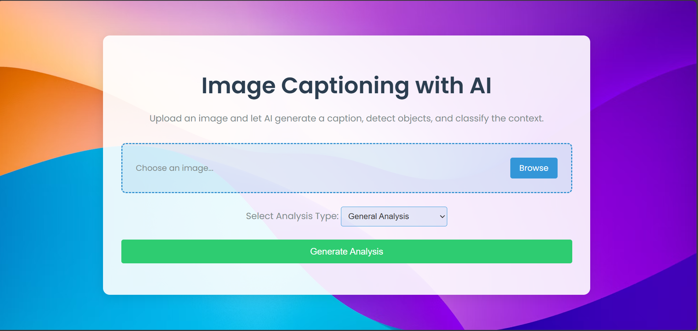
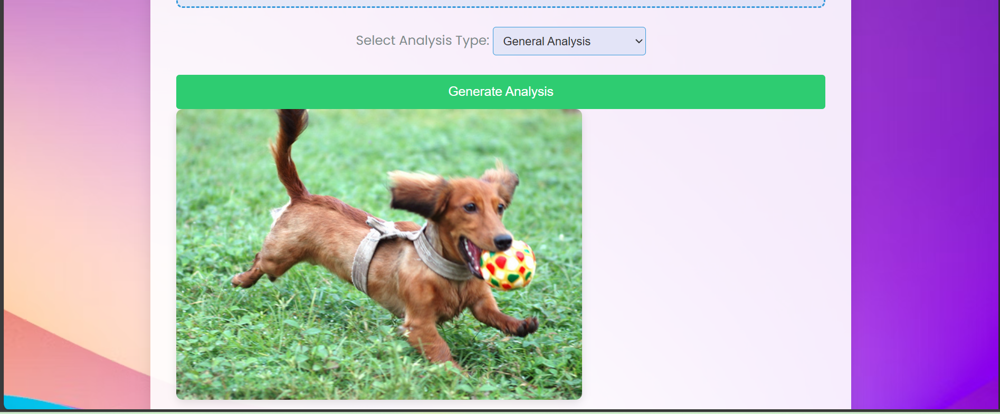
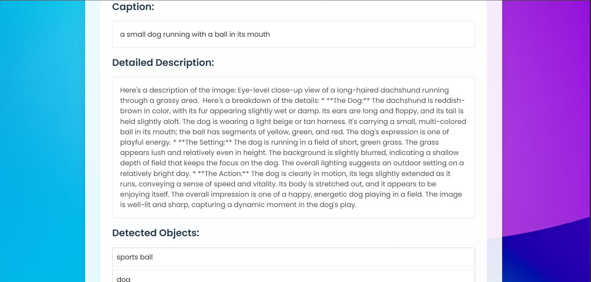
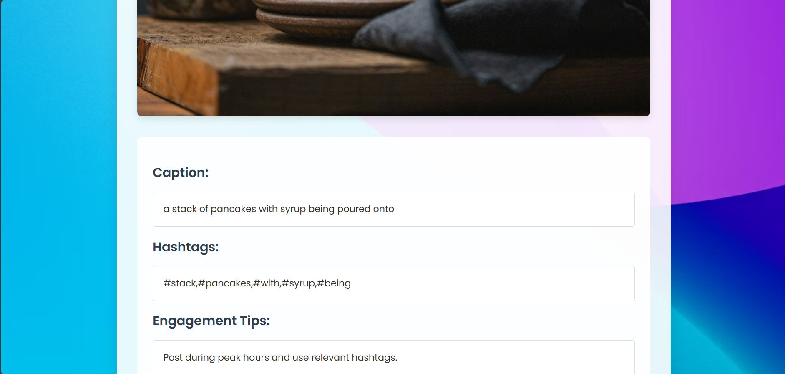
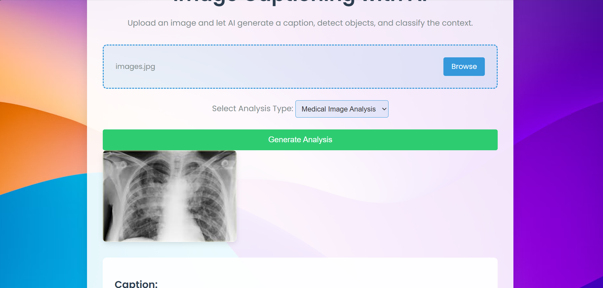
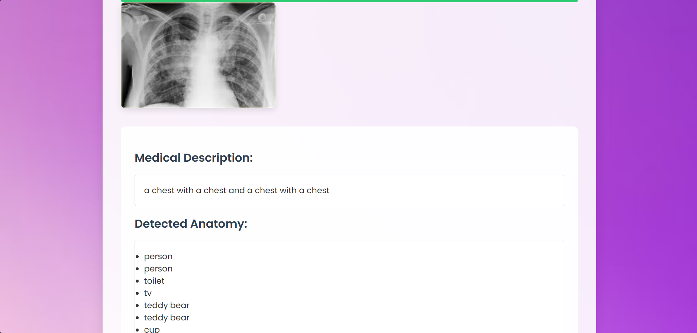
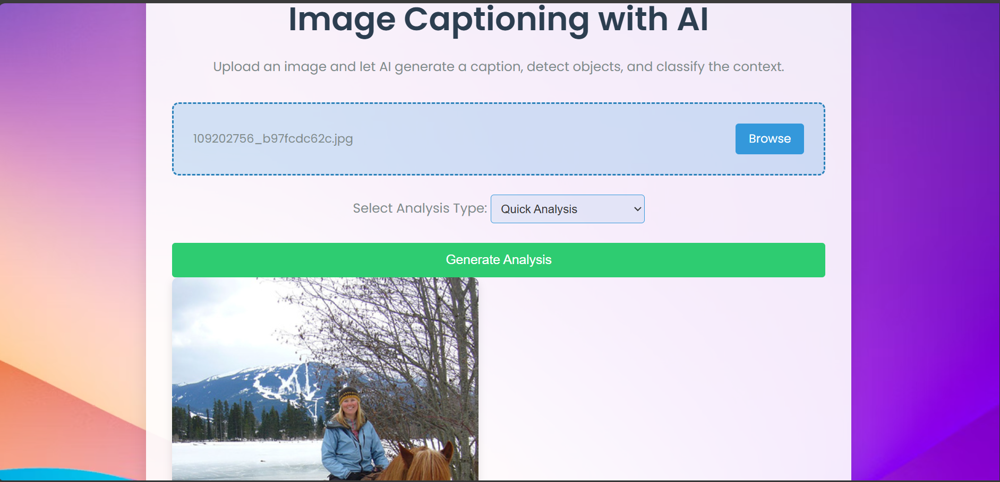
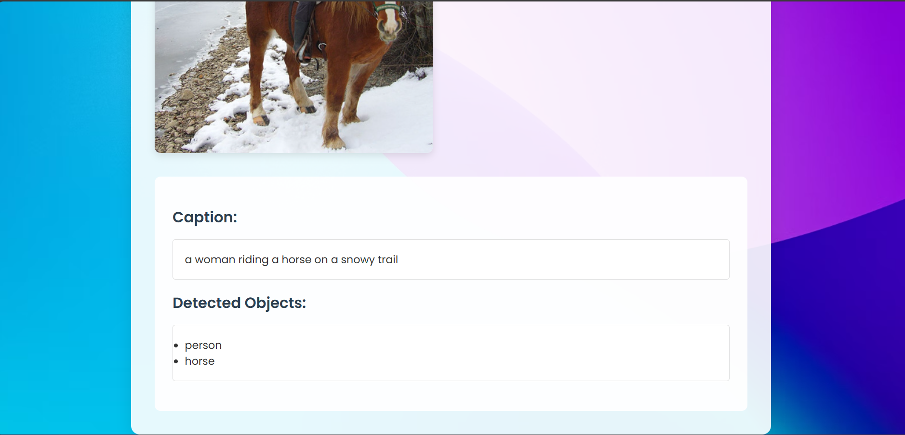

# From-Alt-text-to-Real-Context

This project is an AI-powered image captioning tool that allows users to upload images and generate captions, detect objects, classify context, and perform specialized analyses like **General Analysis**,**Medical Image Analysis**, **Social Media Tool**, and **Quick Analysis**.

---

## Features

1. **General Analysis**:
   - Generate captions for uploaded images.
   - Detect objects in the image.
   - Classify the context of the image.
   - Provide a detailed description of the image.

2. **Medical Image Analysis**:
   - Analyze medical images (e.g., X-rays, MRIs).
   - Generate a medical description.
   - Detect anatomy or abnormalities.
   - Provide recommendations and a confidence score.

3. **Social Media Tool**:
   - Generate captions optimized for social media.
   - Suggest trending hashtags.
   - Provide engagement tips.

4. **Quick Analysis**:
   - Generate a quick caption.
   - Detect objects in the image.

---

## Screenshots

### General Analysis




### Social Media Tool



### Medical Image Analysis



### Quick Analysis



---

## Prerequisites

Before running the project, ensure you have the following installed:

- **Python 3.8 or higher**
- **Flask** (`pip install Flask`)
- **Pillow** (`pip install Pillow`)
- **Transformers** (`pip install transformers`)
- **Torch** (`pip install torch`)
- **Requests** (`pip install requests`)

---

## Installation

1. Clone the repository:
   ```bash
   git clone https://github.com/Shehanshha/From-Alt-text-to-Real-Context.git
   cd image-captioning-ai
